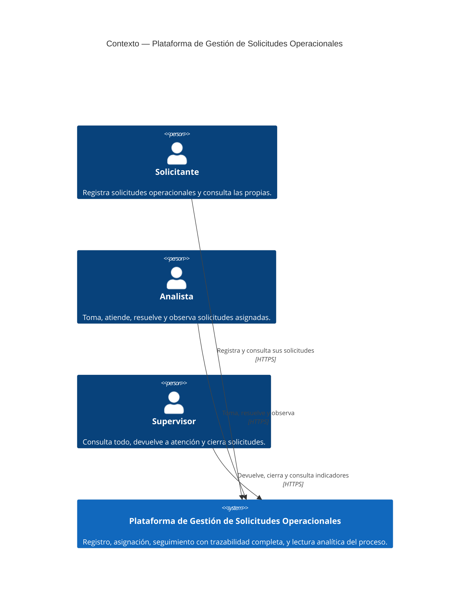

# C4 — Nivel 1: Contexto

Vista de más alto nivel: quién usa el sistema y con qué otro sistema interactúa, sin mostrar
ningún detalle interno.

**Notas de lectura:**

- Los tres actores son roles de un mismo directorio de identidad (Keycloak), no sistemas
  externos: por eso no aparecen como cajas separadas en este nivel — el detalle de identidad
  pertenece al nivel de contenedores (`02-contenedores.md`).
- No hay ningún sistema externo de terceros integrado (no hay pasarela de pagos, ERP externo,
  etc.): el alcance del reto es autocontenido.
