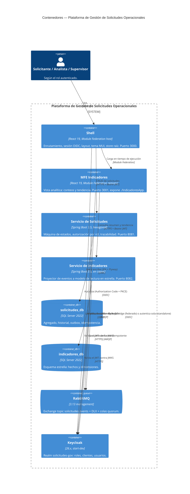

# C4 — Nivel 2: Contenedores

Los bloques desplegables del sistema y cómo se comunican. Corresponde 1:1 con los servicios
declarados en `compose.yaml`.

**Notas de lectura:**

- No hay API Gateway: el navegador habla directamente con los dos orígenes de backend
  (8081 y 8082), consecuencia documentada en el blueprint §5.1 — CORS se configura en ambos
  servicios.
- La flecha `solicitudes → broker → indicadores` no es una llamada directa: es asíncrona,
  mediada por el exchange topic y el patrón Transactional Outbox (ADR-002), detallada en el
  diagrama de secuencia (`03-secuencia-flujo-principal.md`).
- El Shell posee la única instancia de sesión OIDC real cuando corre federado; el MFE la
  consume por `authBridge` (blueprint §9.2). En modo standalone el MFE se autentica solo, sin
  que exista nunca una sesión "huérfana" compitiendo con la del Shell.
