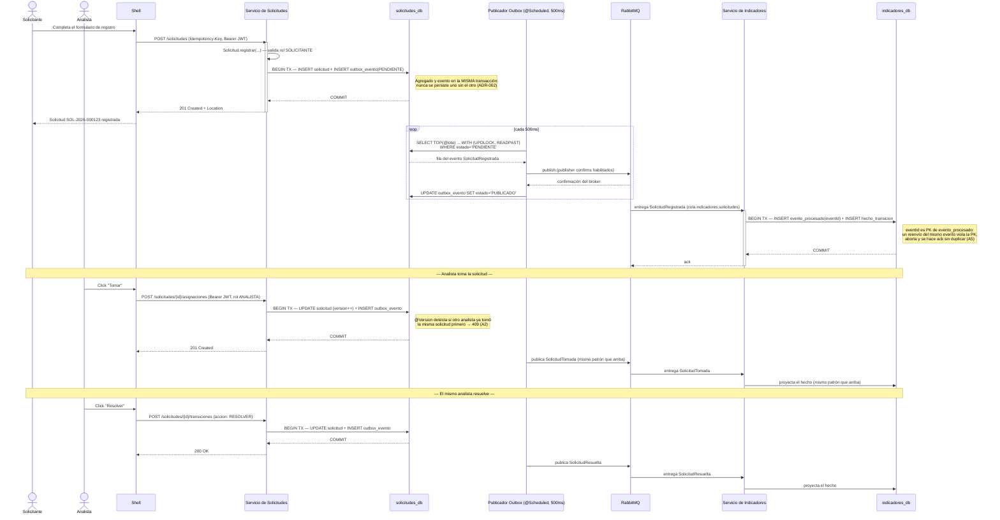

# C4 — Secuencia: flujo principal con eventos

Recorrido completo del escenario de aceptación cubierto por Karate:
`REGISTRADA → EN_ATENCION → RESUELTA`, mostrando el patrón Transactional Outbox (ADR-002) en
el primer paso con detalle completo, y de forma abreviada en los siguientes dos —el mecanismo
es idéntico en las tres transiciones—.

**Notas de lectura:**

- El publicador del outbox y el consumidor de Indicadores corren en bucles independientes del
  ciclo de petición HTTP: la respuesta al Shell (`201`/`200`) nunca espera a que el evento
  llegue a Indicadores. La vista analítica se actualiza con una latencia de hasta ~500 ms más
  el tiempo de entrega del broker.
- `Idempotency-Key` (visible solo en el primer `POST`) protege contra un reintento de red del
  **cliente**; `evento_procesado` protege contra un reenvío del **broker**. Son dos mecanismos
  de idempotencia distintos, en dos puntos distintos del flujo, y ninguno sustituye al otro.
